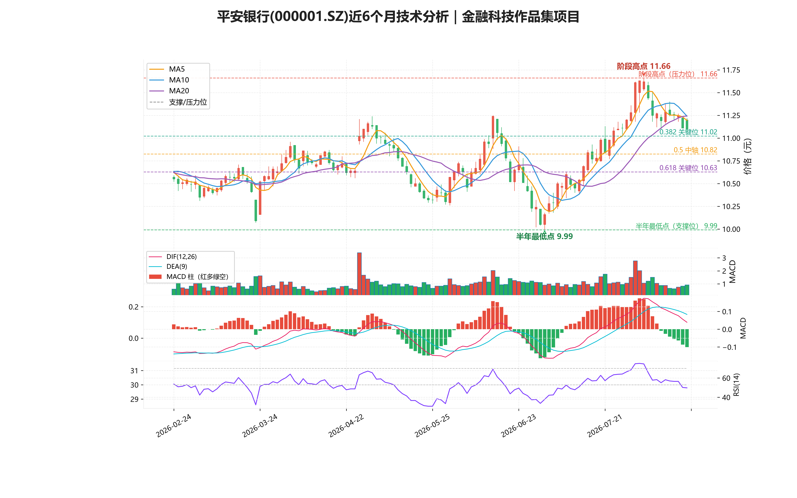
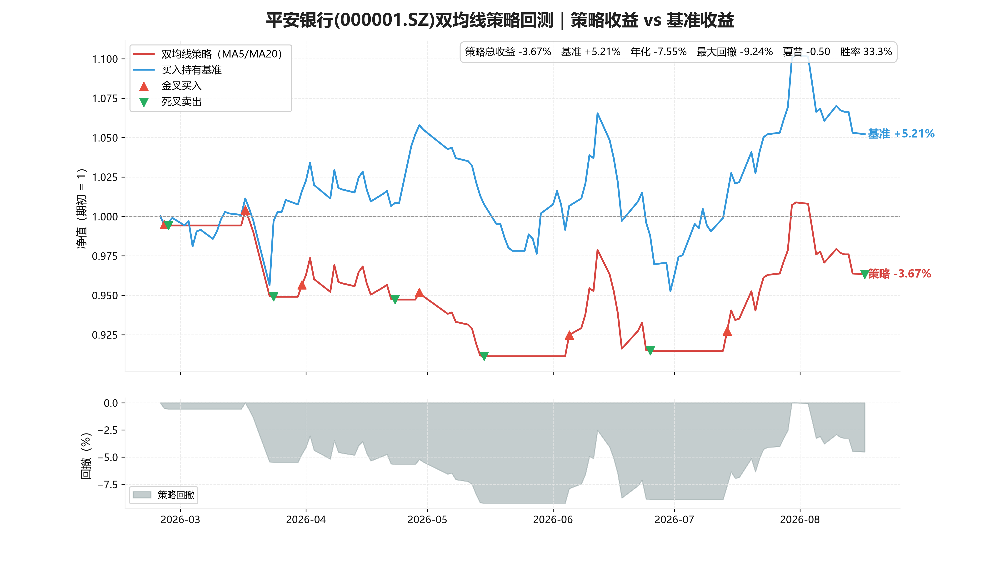

# 平安银行（000001.SZ）个股量化分析系统

**用 Python + AI Agent 做的全流程个股分析**：数据获取 → 清洗 → 指标计算 → 多面板可视化 → 策略回测 → 基本面投研，全流程一键复现。

## 30 秒速览（真实数据 · 2026-02-24 ~ 2026-08-17 · 120 个交易日）

| 指标 | 数值 | 说明 |
|---|---:|---|
| 区间涨跌幅 | **+5.21%** | 前复权日线，期末 / 期初收盘价 |
| 区间最高 / 最低 | 11.63 / 10.05 元 | 2026-07-31 / 2026-06-30 |
| 最大回撤 | -10.59% | 收盘价相对区间高点的最大回撤 |
| 年化波动率 | 18.65% | 日收益率标准差 × √252 |
| 平均日成交量 | 100.6 万手 | 区间内日均值 |
| 期末 RSI(14) | 49.8（中性） | 无明显超买超卖 |
| 双均线策略 vs 买入持有 | -3.67% vs +5.21% | 震荡市趋势策略失效的实证 |

> 一键复现：`pip install -r requirements.txt && python src/main.py`

## 技术栈

Python | Pandas | NumPy | SQL | mplfinance | Codex

## 项目流程

1. 数据获取（akshare：腾讯 / 东方财富 / 新浪多源自动回退，前复权日线）
2. 数据清洗（Pandas：统一列名、类型转换、去重、缺失值与停牌零成交剔除）
3. 指标计算（MA5/10/20、MACD(12,26,9)、RSI(14, Wilder)）
4. 可视化（300 DPI 多面板 K 线：K线 / 成交量 / MACD / RSI，红涨绿跌）
5. AI 智能分析（Codex finance-analyst 生成基本面投研报告）

## 成果展示





## 项目结构

```text
pingan-bank-quant-analysis/
├── src/               Python 源码（main.py 入口 + stock_analysis 模块包）
├── notebooks/         可复现研究 Notebook（数据→指标→统计→回测→图表，完整执行）
├── reports/           技术分析报告 + 基本面投研报告
└── figures/           K线图、回测对比图、日K数据 CSV
```

## AI 工具分工

- ChatGPT：代码生成与调试
- Codex：投研分析 + Notebook 标准化
- 人工：需求设计、业务逻辑、结果校验；把项目文件传上去

## 运行方式

```bash
pip install -r requirements.txt
python src/main.py
```
